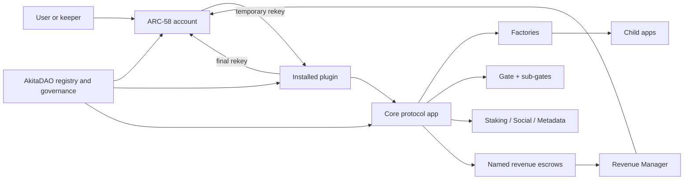

# Akita smart-contract architecture and verification audit

Audit snapshot: 2026-07-14

This document describes the intended end-to-end behavior of every deployable
contract family in this repository, the trust boundaries between them, the
invariants that tests must enforce, and the defects addressed during this
review. It is a code and LocalNet verification report, not a substitute for an
independent production security audit.

## System model

The protocol has four structural layers:

1. `AkitaDAO` is the governance root and canonical registry for core apps,
   social apps, plugins, external dependencies, assets, fee schedules, and
   revenue splits.
2. ARC-58 accounts hold user or DAO funds. They temporarily rekey a spending
   account to an installed plugin, the plugin performs a bounded operation, and
   the final inner transaction rekeys control back.
3. Core protocol apps implement staking, social, subscriptions, rewards,
   trading, gates, and metadata. Factory apps hold approved child bytecode and
   create isolated auction, raffle, poll, prize-box, listing, staking-pool, and
   wallet instances.
4. Named escrow apps isolate balances and MBR ownership. Fee-generating apps
   route protocol revenue to DAO-owned escrows, and the Revenue Manager plugin
   disburses those balances according to DAO-configured splits.

### Protocol-wide invariants

- Authority is derived from the DAO wallet, factory creator, stored owner, or
  authenticated ARC-58 origin. A caller-supplied app/address is never trusted
  merely because it exists.
- Asset ID `0` means ALGO everywhere. ASA holding APIs must not be used for
  asset `0`; ALGO uses account balance and payment transactions.
- Every grouped payment, asset transfer, or application call is authenticated
  by type, receiver/app, amount/asset, method selector, and ordering. Funding is
  either bound to the authenticated actor or explicitly modeled as sponsorship:
  where a later refund exists, the sponsor is persisted as its beneficiary.
- Every box/app/ASA minimum-balance increase has one identified funder. The
  same economic owner receives the exact refund when the resource is deleted.
- IDs are monotonically allocated; existence is checked before mutation; a
  duplicate operation either rejects atomically or is explicitly idempotent.
- Draft, active, settlement, finalization, and deletion phases move forward
  only. Funds cannot be claimed before finalization or left behind after the
  terminal cleanup path.
- Empty plugin batches are invalid. A batch that creates no final inner
  transaction must never leave a spending account rekeyed to a plugin.
- Time windows use chain time. `0` has an explicit meaning (for example,
  perpetual/no-expiration) and is not accidentally treated as Unix epoch.
- Upgrades and registry changes are DAO-authorized. Factory child bytecode is
  loaded in an authenticated, ordered group before it can be used.

## Contract-by-contract end-to-end processes

### Governance and accounts

| Contract | Intended process | Dependencies and terminal state |
| --- | --- | --- |
| `AkitaDAO` | Deploy in draft; partially initialize schemas/settings; install the DAO wallet and registry values; fully initialize; create a funded draft proposal; edit and submit it; calculate normalized governance participation; vote once per eligible voter; finalize after the voting window; execute validated actions in order; delete vote/action boxes and refund vote MBR to its recorded funder. | Reads Staking for governance power, uses `AkitaDAOProposalValidator`, and executes changes through the DAO ARC-58 wallet/plugins. Draft, rejected, and executed proposals are creator-deletable; approved proposals remain until execution. Proposal-storage payments are intentionally DAO-retained. |
| `AkitaDAOProposalValidator` | Decode every proposed action and reject malformed targets, fields, plugin operations, upgrades, or action combinations before governance accepts them. | Stateless policy boundary for `AkitaDAO`; it must agree with DAO action codecs. |
| `AkitaDAOTypes` | Expose ABI shape methods for every governance action so clients encode exactly the tuples the validator and DAO consume. | ABI helper only; it does not own funds or policy. |
| `AbstractedAccountFactory` | Store approved wallet bytecode; opt into required assets/apps; quote exact creation cost; accept a funder payment; create and initialize a wallet; register controlled-address mapping; maintain revocation/DAO/version settings; delete factory-owned boxes with exact refunds. | DAO-authorized upgrades; creates `AbstractedAccount`; uses Escrow Factory and the wallet MBR helper. |
| `AbstractedAccount` | Initialize once with admin, controlled address, factory, referrer, DAO, and revocation app; manage admin/domain/profile; add/remove typed allowances, plugins, named plugins, execution keys, and escrows; authenticate callers/cooldowns/allowances; temporarily rekey a spending account to a plugin; verify it was rekeyed back; reclaim or rotate control through authorized paths. | Central user-fund boundary. Plugins may act only through installed method restrictions. Removed boxes refund exact paid MBR. |
| `AbstractedAccountMBR` | Return canonical MBR quotations for wallet boxes and plugin/execution/allowance state. | Must stay byte-for-byte economically aligned with `AbstractedAccount`. |
| `AbstractedAccountBalanceReader` | Resolve Staking through the DAO and return liquid balance plus hard/lock escrow for each requested asset; return zero for an unowned ASA. | Immutable read helper. ALGO reads account balance; ASAs read holdings; Staking supplies escrow totals. |
| `AbstractedAccountUpdateStub` | Supply the minimal update entry point used by controlled upgrade workflows. | Test/deployment helper; no independent business lifecycle. |
| Ed25519 and secp256r1 passkey logic signatures | Validate the expected passkey signature/domain/transaction constraints and authorize only the intended wallet operation. | Authentication edge; no persistent application state. |

### Escrows, base contracts, and factory lifecycle

| Contract | Intended process | Dependencies and terminal state |
| --- | --- | --- |
| `EscrowFactory` | Quote/register a unique address-to-escrow mapping; create named wallet/DAO escrows; return single or batched lookups; reject duplicates; delete a child only through its authorized owner and refund both child base balance and tracked creation MBR. | Used by ARC-58 accounts and DAO revenue setup. Mapping and child must be deleted consistently. |
| `Escrow` | Initialize under its factory, optionally rekey, hold ALGO/ASAs, and close assets/ALGO only through the authorized delete path. | Its creator is the factory; its economic owner is stored by the factory/wallet. Terminal state is deleted with no stranded balance. |
| Shared base/factory contracts | Resolve DAO registry/fees, enforce DAO-only upgrades, store child bytecode, perform exact asset opt-ins, route revenue, and verify child/factory call order. | These are inherited trust boundaries; a defect here affects every factory or fee generator. |

All child factories follow the same lifecycle: DAO loads approved bytecode,
factory quotes cost, funder pays, factory creates and initializes a child,
child performs its domain lifecycle, child closes holdings to the correct
recipient, factory deletes the app/registry box, and each released MBR component
is returned to the account that actually funded that component. A creation
payment is not one undifferentiated refundable deposit: factory-box MBR,
child-base MBR, child boxes, asset opt-ins, reward allocations, and forwarded
fees retain separate ownership and may be released at different phases.

### ARC-58 plugins

Every plugin call begins with wallet authorization and a temporary rekey. The
plugin must validate its target against the DAO registry or target state,
perform only the installed selector's operation, and rekey the spending account
back on the last inner transaction. The wallet then verifies its auth address.

| Plugin | Intended operation and core dependency |
| --- | --- |
| ASA Manager | Create or delete a non-empty batch of wallet-managed ASAs; collect one ASA-creation MBR per mint. |
| Opt-In / Self Opt-In | Opt a non-empty batch into or out of ASAs; external-payment and wallet-funded variants respectively; reject duplicates, nonzero close-out balances, and empty batches. |
| Pay / Pay Silo / Pay Silo Factory | Send a non-empty mixed ALGO/ASA batch to arbitrary recipients or a fixed silo recipient; factory creates fixed-recipient silo plugins. |
| Auction | Create/fund auctions, bid, draw/find the loser-raffle winner, claim/refund, clear weights, and delete through Auction Factory/Auction. |
| DAO | Create/edit/submit/vote/finalize/execute DAO proposals with the wallet as the authenticated participant. |
| Dual Stake | Mint/redeem against the configured dual-stake app and validate its asset/rate state. |
| Gate | Register composite gate definitions against the canonical Gate app. |
| Haystack Router | Execute the router's authenticated swap group and return wallet control after ALGO/ASA input. |
| HyperSwap | Create/accept/cancel an offer, escrow assets, disburse, withdraw, and clean up through the canonical HyperSwap app. |
| Marketplace | Create listings/prize-box listings, purchase with ALGO/ASA, change price, and delist through Marketplace/Listing. |
| NFD | Proxy the supported NFD registry/vault lifecycle while validating target state and preserving wallet control. |
| Poll | Create a poll, cast optionally gated votes, clear voter boxes, and delete through Poll Factory/Poll. |
| Raffle | Create/fund raffles, enter, draw/find/claim, clear weights, and delete through Raffle Factory/Raffle. |
| Revenue Manager | Register or migrate a DAO receive escrow; opt it into a bounded set of assets; snapshot a disbursement cycle; process each registered asset once according to validated splits; finalize in batches; refund transient MBR; return the escrow to idle. |
| Rewards | Create/fund allocations, finalize, claim, or reclaim through the canonical Rewards app. |
| Social | Proxy post/reply/reaction/vote, graph, moderation, metadata, and impact operations to the four canonical Social apps. |
| Staking | Stake/withdraw/checkpoint/update settings through canonical Staking; checkpoint batches must be non-empty. |
| Staking Pool | Create/finalize/enter/fund/disburse/delete isolated pools through Staking Pool Factory. |
| Subscriptions | Create/activate/configure a service; subscribe/deposit/trigger/unsubscribe; manage blocks/passes through canonical Subscriptions. |
| Sunset | Close wallet assets/ALGO/boxes only during the authorized decommission workflow. |
| Update Akita DAO | Load factory bytecode, update registered apps/children/revocation/settings, and rekey control back under DAO authorization. |
| Test Close-Out / Test Proxy Rekey | Exercise close-out and nested-plugin rekey invariants in LocalNet tests; not production features. |

### Staking and staking pools

`Staking` is initialized once by its creator, who becomes the initial heartbeat
manager. The app opts into an ASA with exact MBR, then users create one of four
validated stake types:

- heartbeat records observed wallet/escrow balance over time;
- soft stake records a balance-backed commitment without custody;
- hard stake escrows funds until expiration;
- lock stake escrows funds and contributes locked governance power.

Checkpoint operations lower invalid soft commitments; withdrawal releases only
eligible escrow; app-specific soft commitments let pools reserve a portion of a
user's soft stake. Hard/lock withdrawal deletes the stake first, decrements
totals atomically, and returns both custody and the exact stake-box MBR. Soft
and heartbeat records have owner-only terminal closes; heartbeat close removes
its paired history box atomically. An app-specific snapshot is independently
funded and remains independently releasable even after its root soft record is
closed. ALGO heartbeat uses account balance, never an ASA-holding lookup for
asset zero.

`StakingPoolFactory` creates a pool with creator, type, optional asset merkle
root, minimum quantity, gate, maximum entries, and fee configuration. The
creator adds rewards and finalizes signup/start/end times. A participant passes
the gate/root/minimum and relevant Staking check, then receives one indexed
entry per asset. Reward cycles prepare eligible stake, allocate percentage,
flat, even, or shuffle rewards, write allocations into Rewards, finalize the
Rewards disbursement, and reset the per-reward cursor. Entry/reward counts are
actual counts (next ID minus one), maximum entries include the entire submitted
batch, shuffle ranges are half-open, and the beacon comes from the configured
DAO registry.

### Rewards and subscriptions

`Rewards` supports two creation modes. Multi-step creation reserves a
disbursement, adds ALGO/ASA user allocations in batches, then finalizes. Instant
creation validates a non-empty, unique, positive allocation batch and funds it
atomically. Claims require finalization, unlock time, a live allocation, and
either an unexpired deadline or expiration `0` (never expires). Only the creator
may reclaim an actually expired disbursement. Allocation and disbursement boxes
are deleted/refunded as claims or reclaims consume them.

`Subscriptions` creates a draft service and requires a same-merchant activation
later in the same group. The creation payment and referral are ALGO-denominated
even when recurring payments use an ASA. The retained service MBR reserves the
full maximum description so later chunk writes remain funded. A subscriber
creates a donation/service subscription, optionally passes a gate, and may
deposit future payments. A keeper can trigger an elapsed interval, but gate
eligibility is evaluated for the subscription owner, not the keeper. Fees,
referral, trigger reward, and merchant payout are split exactly. Unsubscribe
deletes the subscription's own pass key and refunds its boxes; block, pause,
shutdown, streak, and withdrawal paths preserve their respective ownership.

### Social protocol

`AkitaSocial` owns posts, replies, reactions, votes, per-user metadata,
paywalls, and reference types. `AkitaSocialGraph` owns follows, follower index,
blocks, and graph paywalls. `AkitaSocialModeration` owns moderator roles,
flags/actions, and bans. `AkitaSocialImpact` combines social inputs, staking,
and subscription modifiers into an impact score and checkpoints staking impact.

The intended flow is initialize the four apps in the DAO registry, initialize a
user's metadata, create content with exact fee/MBR/paywall payment, mutate it
only as its author or authorized moderator, update symmetric counters on every
reaction/follow add or delete, and compute impact for the requested subject.
Default app/address fallbacks must resolve to the canonical DAO entry; callers
cannot substitute an arbitrary app. Impact modifiers may be changed only by
their owning canonical protocol app or DAO authority.

### Gates

`Gate` stores a composite list of `(subGate, registryID, logical operator)`
layers. Registration validates a non-empty, structurally complete expression,
charges per encoded byte, and invokes each caller-selected deployed sub-gate.
The party creating a gated resource chooses that policy; the sub-gate's own
registration method proves its implementation and canonical data sources.
Check evaluates the caller with supplied per-layer args and exact AND/OR
semantics; malformed operators, missing args, and unsupported sub-gates reject.

The 16 sub-gates register immutable criteria and check:

| Sub-gate | Canonical source and criterion |
| --- | --- |
| Akita referrer | Wallet Factory/Escrow mapping; expected referrer. |
| Asset | Account ASA balance and comparison operator. |
| Merkle address / asset | MetaMerkles root/type/proof for an address or ASA. |
| NFD / NFD root | Canonical NFD registry ownership, parent/root boundaries, and exact name slicing. |
| Poll | Canonical poll participation/vote state. |
| Social activity | Canonical Social post/reply/reaction activity. |
| Social follower count / index | Canonical Social Graph count or indexed relation. |
| Social impact | Canonical Social Impact score and comparison. |
| Social moderator | Canonical Social Moderation role. |
| Staking amount / power | Canonical Staking amount or weighted power with whitelisted operators/types. |
| Subscription / streak | Canonical Subscriptions active state or streak. |

### Metadata, polls, and prize boxes

`MetaMerkles` lets an address define a schema/type, pay for a named root, update
the root, attach non-reserved metadata, verify typed proofs, and remove metadata
before deleting/refunding the root. Metadata keys cannot be overwritten with a
second paid allocation. New type metadata contains a format marker and live
metadata count; legacy roots remain verifiable but fail closed on deletion
because their historical count is unknowable.

`PollFactory` creates a time-bounded `Poll` with choices, optional Gate, and
box MBR. The poll accepts only exact vote enum values, allows one vote per
address during the window, stores totals/voter boxes, then deletes voter boxes
and the app through its factory. The Poll plugin authenticates wallet-origin
voters.

`PrizeBoxFactory` creates a `PrizeBox`, which opts into each asset exactly once,
receives a bundle, transfers ownership as one unit to Marketplace/Auction/Raffle
or a recipient, permits authorized withdrawal, and closes all assets/ALGO on
deletion. Duplicate opt-in must reject without incrementing its asset count.

### Marketplace and auctions

`Marketplace` validates a seller/prize, creation payment, reservation, gate,
expiry, royalties, and payment asset; creates a `Listing`; funds each required
child opt-in with exactly one ASA opt-in MBR; and moves the prize into custody.
The buyer passes reservation/gate checks and pays the exact price in ALGO or the
configured ASA. `Listing` splits creator, protocol, listing-marketplace,
buy-marketplace, referral, and seller amounts without underflow, transfers the
prize, and becomes terminal. The seller may change only to a settlement-safe
price or delist before sale. Factory cleanup returns child/box MBR to its owner.

`AuctionFactory` creates an `Auction` and transfers an ASA or PrizeBox into it.
After start, each valid higher bid becomes the current winner; an outbid amount
is refundable minus its configured loser-raffle fee. After end, the high bidder
claims the prize and its full winning amount is split as sale proceeds. If fees
exist, VRF selects only among losing bidder weight, chunked winner search finds
the address, and that address claims the solvent fee pool. Zero-fee or no-loser
auctions bypass raffle settlement. A current high bidder cannot immediately
outbid itself: that would create retained fee value without eligible losing
weight and make raffle settlement impossible. A bidder may bid again after a
different address becomes highest. All bid/weight/location boxes are cleared,
MBR is refunded, and only then can the factory delete the child. ASA protocol
fees go to the configured DAO escrow address, not the DAO app address.

### Raffles

`RaffleFactory` creates a configured `Raffle` and moves an ASA or PrizeBox into
custody. Configuration enforces coherent start/end time and participant bounds.
During the live window, each entry validates ticket asset/amount, optional Gate,
and maximum participation, then records address weights and MBR ownership.
After end and minimum participation, VRF draws a half-open ticket, chunked
search identifies the winner, and the winner claims the prize while proceeds
and protocol/marketplace/referral fees settle. Entry/weight boxes are cleared
and refunded before factory deletion. A raffle with no entries has an explicit
creator cancellation path so prize and MBR cannot be trapped.

### HyperSwap

The offeror creates an offer with a deterministic MetaMerkles namespace,
participant set, expiration, and exact offer/root MBR. Each participant accepts,
escrows its declared ALGO/ASAs, and is tracked exactly once. When every party is
funded, permissionless disbursement sends declared outputs; otherwise authorized
cancel/withdraw restores escrow after expiry/cancellation. Participant and
offer cleanup delete all tracking boxes and the metadata root, and refund their
respective MBR owners. MetaMerkles names remain within its 31-byte limit; raw
32-byte merkle roots are data, not namespace names.

### Haystack Router and external protocol adapters

The Haystack SDK first requests a quote for the ARC-58 wallet's spending
address, builds the router group, and passes that unsigned group to the Akita
SDK. The Akita SDK accepts only the configured router and finalize selector,
requires exactly one wallet-to-router funding transaction, validates the input
and output assets, principal, minimum output, beneficiary, referral fields, fee
range, and bounded one-byte references, then replaces that funding transaction
in place with the wallet plugin call. Any other wallet-sent transaction or app
opt-in is rejected. The original funding fee is moved to the caller-signed app
call; the wallet's inner funding transaction uses fee zero, so the controlled
account loses only swap principal. Group IDs are cleared before composition and
the wallet must be rekeyed back before verification.

NFD and dual-stake are also external protocol adapters. Their local tests use
ABI-compatible deterministic registry/child mocks to prove Akita-side group,
state, balance, sender, and rekey behavior. Those mocks cannot prove live API
availability, external deployment state, unmodeled route variants, or behavior
after an upstream upgrade; production pins and live smoke tests remain separate
release gates.

### Plugin DEX and sunset contracts

`PluginDex` creates named pools, stores ordered hooks, enables/disables hooks,
and lets only the pool administrator run configured hook calls or change pool
state. Pool/hook boxes are paid exactly and IDs cannot be confused across
pools.

`SunsetContract`, `SunsetPlugin`, and `WalletFactorySunsetContract` implement a
strictly authorized teardown: close wallet escrows, assets, boxes, wallet apps,
factory boxes/assets, and finally ALGO/apps in the dependency order encoded by
the sunset scripts. Destructive entry points are creator/deployer-only; a public
caller cannot seize the cleanup transaction's close/rekey destination.

### Test-only contracts and libraries

Mock DAO, wallet/factory, Social, Marketplace, Auction/Poll/PrizeBox/Raffle/
StakingPool factories, Subscriptions, Staking consumer, and randomness beacon
contracts isolate cross-contract tests. PCG32/PCG64 source files implement the
deterministic range generator used after beacon entropy. They are support code,
not separately governed production modules.

## Findings and remediation matrix

| Severity | Area | Finding | Remediation and regression |
| --- | --- | --- | --- |
| Critical | Sunset | Destructive calls could be reached without a teardown authority check. | Require creator/deployer on every destructive entry and test hostile callers. |
| Critical | Wallet plugins | Empty batches could emit no final rekey transaction. | Reject empty batches on-chain and assert failed groups preserve auth address. |
| Critical | Child factories | Several factories recorded the caller's whole creation payment as refundable factory MBR even after forwarding portions to child apps, Rewards, or escrows. Deleting one child could therefore refund value retained for other users. | Separate factory-retained MBR from every forwarded cost, record each resource's actual funder, refund only released minimum balance, and assert isolated and pooled-factory balances before and after deletion. |
| Critical | Marketplace ASA settlement | The ASA purchase ABI method used an unrecognized decorator property, so it compiled as `NoOp` while its logic assumed terminal `DeleteApplication` cleanup. A successful purchase could leave the listing app and its MBR stranded. | Declare the allowed `DeleteApplication` action correctly, have both factory purchase routes call the child with that action explicitly, and assert prize/payment settlement, child deletion, and exact factory balance. |
| High | HyperSwap | A 32-byte root was used as a MetaMerkles name (maximum 31), offer/participant/root MBR lacked symmetric cleanup, and an ASA trade leaf could be funded by a different sender or clawback source. | Deterministic short namespaces, explicit MBR payor, actor-bound non-clawback ASA principal, exact MBR ownership, and full cancel/disburse/cleanup tests. |
| High | DAO | Participation compared differently-scaled AKTA/BONES quantities. | Apply the shared governance scale before participation percentage and test normalized versus raw values. |
| High | DAO terminal state and vote MBR | Rejected proposals had no deletion path, while vote boxes were underquoted and did not remember who funded their MBR. | Permit creator cleanup for draft/rejected/executed proposals, charge only the first vote, persist its funder, refund that sponsor when vote storage is deleted, and cover unauthorized and terminal paths. |
| High | DAO plugin rekey ordering | `newProposal` could rekey the controlled account back during its preliminary cost query, before the payment and state-changing proposal call. | Keep the readonly quotation call unrekeyed and apply `rekeyTo` only to the final proposal call; exercise the initialized default-rekey lifecycle. |
| High | Account | Unknown allowance types fell through; interval zero and epoch-zero drip were unsafe; execution boxes were underfunded/unrefunded. | Exact enums/intervals, anchored drip state, exact create/grow/consume/remove MBR regressions. |
| High | Staking | Initialization was repeatable; heartbeat manager was unset; ALGO heartbeat used ASA holding; invalid types could lock funds. | Creator-only one-shot init, assigned manager, native ALGO balance, pre-mutation enum validation. |
| High | Staking terminal state | Soft, heartbeat, and app-soft records lacked complete symmetric close/refund paths, and wallet-created records were not all reachable through the ARC-58 plugin. | Add exact-MBR terminal closes, atomic heartbeat cleanup, independent app-stake release after root close, SDK/plugin hooks, and exact-balance regressions. |
| High | Revenue Manager | Caller-supplied asset IDs could finalize the wrong cycle and transient asset boxes leaked MBR; installed method list omitted finalization. | Bind registered asset identity to a cycle, bound batches, charge/refund transient MBR, validate splits/migrations, install finalizer selector. |
| High | Auction | Raffle pool included unretained winning fees/weight and could be insolvent; zero-fee auctions could not delete; ASA protocol fee used the wrong address. | Accrue only retained losing fees, exclude winner, bypass nonexistent raffle, correct escrow receiver, add terminal lifecycle tests. |
| High | Auction consecutive bids | A current highest bidder could outbid itself, producing a nonzero loser-fee pool with no eligible loser weight and permanently blocking winner selection and deletion. | Reject consecutive self-outbids atomically while allowing a bidder to return after another address becomes highest; cover both sequences through the plugin. |
| High | Raffle | Invalid bounds and zero-entry terminal paths could trap prize/MBR. | Validate configuration, add no-entry cancellation/refund/delete path, test boundary and full lifecycle behavior. |
| High | Subscriptions | Service activation was not bound to the same merchant; keeper was gate subject; fund transactions were not bound to the resource owner; ASA service creation used the wrong referral asset; pass cleanup used service ID. | Bind grouped ALGO/ASA senders and activation order, reject clawback-source transfers, gate the subscriber origin, use ALGO creation fee, and delete the subscription-keyed pass. |
| High | Social | Several default app/address paths accepted caller substitutions, grouped post/reply funding was not uniformly sender-bound, and reaction/graph/modifier lifecycle accounting was asymmetric. | Resolve canonical apps through the DAO, bind MBR and tip senders (reject clawback-source tips), enforce paywall/reference targets and modifier authority, and test add/edit/delete counter and exact-MBR symmetry. |
| High | Rewards | Unfinalized allocations were claimable; expiration zero was both allowed and unusable; instant empty/duplicate allocations were unsafe. | Finalization guard, explicit never-expiring semantics, positive unique instant batches, claim/reclaim regressions. |
| High | Rewards terminal state | Allocation MBR was not represented as reusable credit, fund transactions were not bound to the stored creator, and terminal disbursement storage had no complete exact-refund close. | Bind ALGO/ASA funders (including rejecting clawback-source transfers), track available/used credits, resize dynamic-string MBR exactly, release credits on claim/reclaim, add fail-closed `closeDisbursement`, and test ALGO/ASA wallet round trips. |
| High | PrizeBox | Creation and per-asset opt-in costs did not retain enough funder identity to return each released MBR to its economic owner. | Record the mint funder and asset-opt-in funders, coordinate terminal deletion through the factory, and verify multi-funder exact refunds. |
| High | Haystack Router | The wallet plugin trusted too much of an externally built group, allowing ambiguous funding/finalize layout, stale group IDs, unsafe wallet-sent transactions, or fee leakage. | Pin router app and selector, validate exactly one finalize plus bounded references and economic fields, replace exactly one wallet funding transaction, bridge signers explicitly, move its fee to the caller, and test ALGO/ASA routes against a deterministic router mock. |
| High | MetaMerkles | Paid metadata could be overwritten and roots deleted before metadata cleanup. | Reject overwrite/reserved deletion, marked live-count metadata, fail-closed legacy deletion, cleanup regressions. |
| High | Staking Pool | Entry/reward count and max-entry arithmetic were off by one/batch; shuffle cursor/ranges and beacon registry were wrong. | Actual counts, whole-batch cap, half-open cursor logic, canonical beacon, isolated ALGO eligibility/shuffle tests. |
| Medium | Marketplace | ASA child opt-in was overfunded, grouped funding was not actor-bound, and price changes could cross the settlement minimum. | Exact one-opt-in payment, bind ALGO/ASA senders (including clawback-source rejection), enforce the safe update minimum, and cover ALGO/ASA settlement and revenue. |
| Medium | Gates | Malformed composite layers/operators/args and several sub-gate target/slicing rules were unchecked. | Strict structure/operator/target validation and negative tests. |
| Medium | Poll / PrizeBox | Poll accepted non-enum values; repeat PrizeBox opt-in corrupted count. | Exact enum set and atomic duplicate rejection tests. |
| Medium | Escrow Factory | Creation/register funding was not caller-bound, and child deletion refund omitted the child's base application balance. | Bind grouped payments, include child base balance, and verify sponsor rollback plus terminal refund. |
| Medium | Shared harness | SDK hash imports were incompatible with the installed ESM package; time warp was cumulative wall-clock based; local sticker tests required unavailable IPFS. | Align Noble v2 imports, chain-relative LocalNet warp, deterministic file-URL test fallback. |
| Medium | Plugin SDK parity | Existing hook smoke coverage enumerated only methods already present on each SDK, so an omitted contract operation could never fail the test. | Compare every callable ABI method whose first argument is the ARC-58 wallet against selectors exposed by SDK hooks; add missing DAO, auction, raffle, rewards, staking, and update hooks. |

## Verification strategy

The repository initially contained 53 Vitest files and roughly 898 runnable
test declarations over approximately 94 generated ARC-56 artifacts and 890 ABI
methods. Declaration count is not treated as method coverage: deployment-only,
placeholder, generic-rejection, and order-dependent tests were identified
separately.

Verification is performed in this order:

1. Run the mandated root build, which compiles the interconnected contract tree
   and regenerates every ARC-32/ARC-56 artifact and SDK client.
2. Run focused LocalNet suites for every changed family so a failure is tied to
   one lifecycle.
3. Run SDK unit tests and TypeScript checks against the regenerated ABIs.
4. Run the complete smart-contract suite without `skip`, `only`, or `todo`.
5. Re-run the root build after any compiler-driven source change and inspect
   the final diff for generated ABI/state changes.

The tests are expected to cover, for each stateful lifecycle: valid ALGO and ASA
paths where applicable; unauthorized caller; malformed transaction group;
invalid enum/bounds/time; duplicate/replay; insufficient and excessive payment;
state and balance conservation; partial batched progress; final claim/refund;
box/app deletion; and auth-address restoration after plugin use or rollback.

## Deployment and migration notes

- Regenerate and publish SDK clients with the same release as the contracts;
  several fixes change generated state or tuple types.
- HyperSwap offer values now identify the MBR payor and use a different metadata
  namespace. Drain/cancel legacy offers before upgrading or provide a dedicated
  migration; do not decode old offer boxes with the new tuple blindly.
- New MetaMerkles roots use a count-format marker. Legacy roots continue to
  verify and update, but deletion intentionally fails closed until an explicit
  off-chain inventory/migration policy is executed.
- Staking Pool `entryCount` and `rewardCount` now report actual counts rather
  than cursor-derived inflated values. Consumers that compensated for the old
  behavior must remove that compensation.
- Child-factory funder records now distinguish factory-retained MBR from values
  forwarded to child apps and downstream contracts. Existing records encoded
  with whole-payment semantics must be drained under their old bytecode or
  migrated explicitly; do not refund them using the new accounting.
- PrizeBox now records both its mint funder and each asset-opt-in funder so
  terminal cleanup can refund the correct accounts. Legacy boxes without those
  records require a dedicated close/migration path.
- `ProposalVoteInfo` now includes the first-vote MBR funder. Existing vote boxes
  have the old tuple layout and must be removed before upgrade or converted by
  an explicit migration; they cannot be decoded as the new tuple.
- Legacy Marketplace ASA listings were created under bytecode whose purchase
  route did not delete the child. Inventory and delist/close those applications
  before replacing the factory child hash; newly generated SDK clients expect
  the corrected terminal action.
- Revenue escrow plugin method restrictions must include finalization as well
  as opt-in/start/process, or a disbursement can never return to idle.
- Increased Subscriptions service MBR is intentional retained reserve for the
  maximum description. SDK cost quotation reads the contract, so clients must
  not hard-code the old amount.
- Existing deployed apps are not changed by passing LocalNet tests. Upgrades,
  bytecode loading, registry changes, and migrations still require the normal
  DAO proposal and production rollout process.
